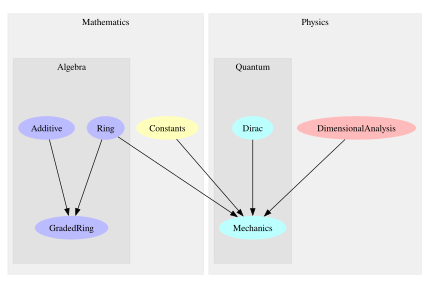

# The Standard Model in Haskell

All four fundamental forces of nature (electromagnetism, weak nuclear force, strong nuclear force, and gravity) in Haskell. Even though general relativity is not technically part of the Standard Model of particle physics, it is fully included as it is part of our best known understanding of the universe, and because quantum gravity is an active area of research.

